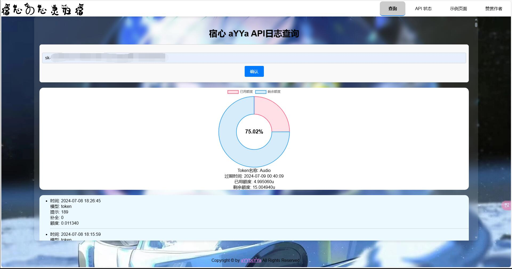
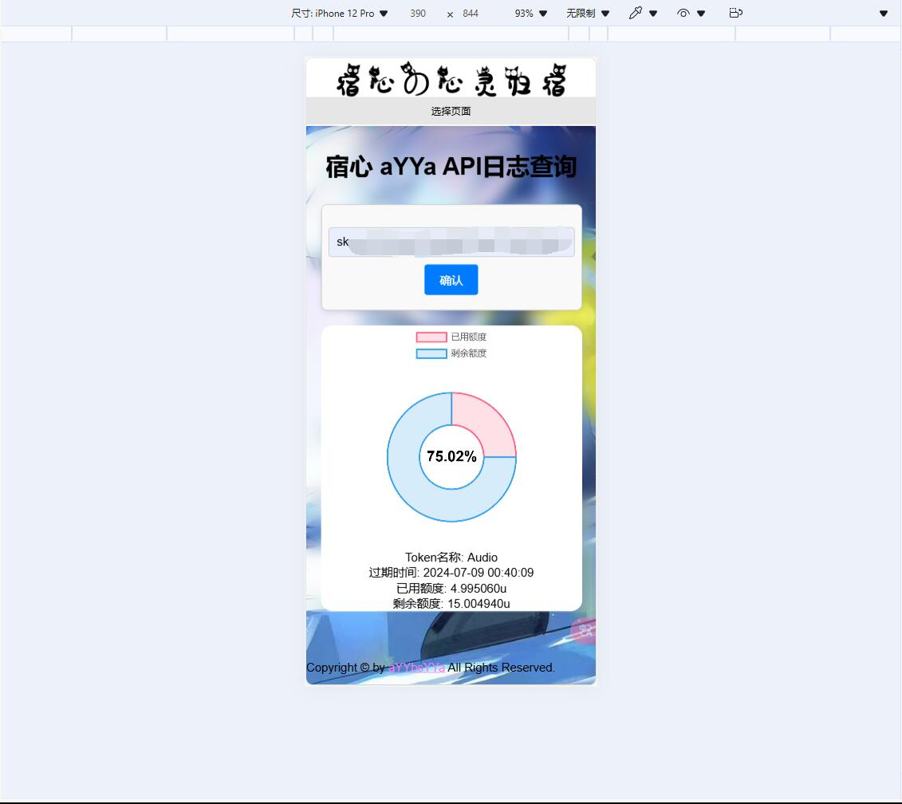
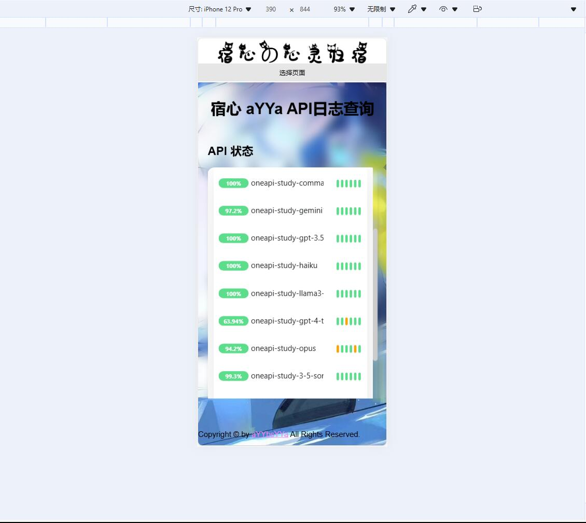

# one_api_key_query-tool

> [!NOTE]
> 本项目为开源项目，使用者必须在遵循 OpenAI 的[使用条款](https://openai.com/policies/terms-of-use)以及**法律法规**的情况下使用，不得用于非法用途。
>
> 根据[《生成式人工智能服务管理暂行办法》](http://www.cac.gov.cn/2023-07/13/c_1690898327029107.htm)的要求，请勿对中国地区公众提供一切未经备案的生成式人工智能服务。

## 使用方法
    1.下载压缩包或者git本项目到本地
      git clone https://github.com/OneApi-cc/one_api_key_query-tool.git
    2.上传到网站服务器目录下
    3.填写\query\query_key.php里Mysql数据库连接信息
    4.修改js\query_key.js里的API密钥查询URL域名
    5.添加index.html的tab-2-pages里的API状态页面URL
    6.访问index.html就可以了

## 其它说明
    该项目需配合One-API才能正常使用：https://github.com/songquanpeng/one-api
    并且是使用Mysql数据库存储API密钥信息

    API状态页面搭建：https://github.com/louislam/uptime-kuma
    搭建好后填入到tab-2-pages里的API状态页面URL即可

    如果是上游的监控（禁止内嵌API状态页面），可以使用代理服务器的方式，将API状态页面的URL指向自己的服务器地址
    相关配置文件在目录api_monitor_nginx.txt

    背景图片在CSS\style.css里设置，或替换目录图片（logo，赞赏码也是）

## 番外
    该项目仅供学习交流使用，请勿用于商业用途！
    第一次写web哈，如不好，还请指正（所以狂写注释，就怕下次自己忘了哈qwq）
    还请尊重原创，不甚感谢！

## 样例展示
### PC端

### 移动端
（ps：手机端展示效果不佳，请用PC端查看【因为真不会写自适应 致歉！】）

### 监控页面

## 鸣谢
感谢开源项目：https://github.com/louislam/uptime-kuma
感谢开源项目：https://github.com/songquanpeng/one-api

## 加入知识交流群
Q group：798734094

## 动力支持
如果觉得项目对您有帮助，欢迎请作者喝杯咖啡☕️

